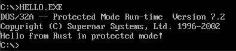

# dos-rs

Create DOS protected mode programs with Rust!

## Wait, what!? Why?

Because it is possible!

## How?

This (ab)uses the fact that the Watcom linker can consume elf objects. The Rust code
creates a static library that then gets linked with a small OMF object, that just defines a
stack segment, into a dos32x executable, using the dos32a extender.

The idea is that the dos::* and dpmi::* modules will support all int 21h and DPMI calls,
respectively.

## Dev setup

This uses [Nix](https://nixos.org) for pulling in dependencies and creating a dev
environment. Install Nix and issue `nix-shell` in the directory to get a shell with all
the tools.

If you are not using Nix, you will need

- GNU Make
- Rust nightly
- OpenWatcom (with $WATCOM pointing to the installation)
- Dosbox/MS-DOS/FreeDOS etc. for running the code

To build all examples, use `make`. To build a specific example, use `make
<example-name>`. The resulting executables can then be run with dosbox (included in the
shell) or on MS-DOS/FreeDOS etc.
